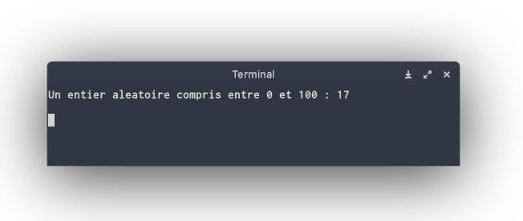
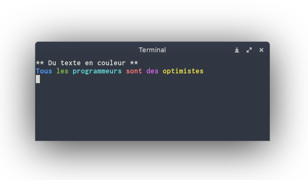
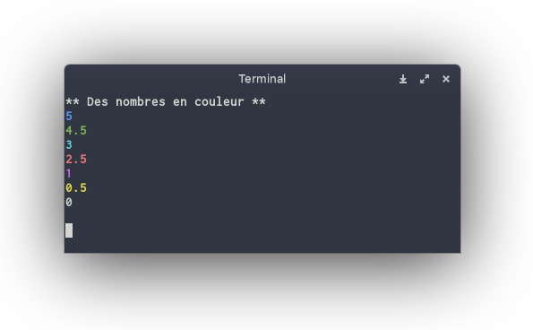
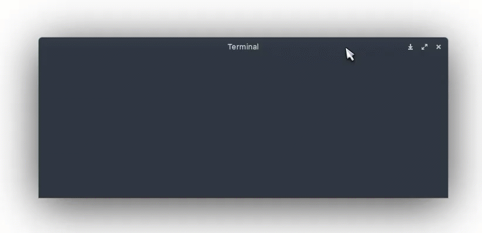
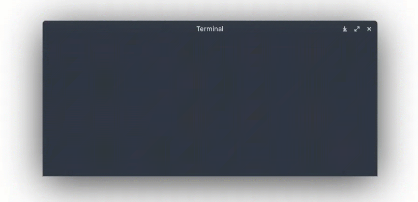

# game-tools-linux

game-tools est un petit module C++ contenant des sous-programmes utiles pour développer des petits jeux s'exécutant dans un terminal. Ce module met à disposition des fonctionnalités simples permettant d'effacer le terminal, de mettre le programme en pause,
d'afficher des éléments en couleur ou encore de générer un nombre entier aléatoire.

Cette version du module `game-tools` n'est utilisable que sur des systèmes d'exploitation **linux**.

La documentation Doxygen du projet est disponible sur <a href="https://patrick-etcheverry.github.io/game-tools-linux/files.html">cette page</a>.


[](https://github.com/Naereen/badges/)

![Magic](https://img.shields.io/badge/Made%20with-Magic-orange?style=for-the-badge&logo=)


## Installation

Télécharger les fichiers `game-tools.h` et `game-tools.cpp` présents dans ce dépôt puis ajoutez les à votre code.

**Exemple**

En supposant que :
- le code de votre jeu se trouve dans le fichier `main.cpp`,
- les fichiers `game-tools.h` et `game-tools.cpp` se trouvent dans le même répertoire que le fichier `main.cpp`,

vous pouvez intégrer les fonctionnalités du module game-tools dans votre code via une directive `include` :
```cpp
#include "game-tools.h"
#include <iostream>
using namespace std;

int main(void)
{
    return 0;
}
```

**Fichier de démo**

Si vous voulez tester le module `game-tools` vous pouvez également récupérer le fichier `main.cpp` : il contient un petit programme de démonstration qui illustre l'usage des différentes fonctionnalités proposées par `game-tools`.


## Utilisation


### Générer un nombre entier aléatoire

La fonction `random` permet de générer un nombre **entier** compris dans un intervalle défini par une valeur minimale et une valeur maximale.

Le code ci-dessous montre un exemple d'usage de la fonction `random` pour générer un nombre entier compris entre 0 et 100.

```cpp
#include "game-tools.h"
#include <iostream>
using namespace std;

int main(void)
{
   unsigned short int nombreAleatoire;

   // Générer un nombre aléatoire compris entre 0 et 100
   nombreAleatoire = random(0, 100);

   // Afficher le nombre aléatoire
   cout << "Un entier aleatoire compris entre 0 et 100 : " << nombreAleatoire << endl;

  return 0;
}
```




### Manipuler des couleurs
Le module *game-tools* met à disposition un type `Couleur` qui peut être utilisé pour déclarer des variables représentant des couleurs :  

```cpp
#include "game-tools.h"
#include <iostream>
using namespace std;

int main(void)
{
   Couleur maCouleurPreferee; // une variable de type Couleur

   return 0;
}
```

Les variables de type `Couleur` peuvent prendre les valeurs suivantes bleu, vert, cyan, rouge, violet, jaune ou blanc :
```cpp
#include "game-tools.h"
#include <iostream>
using namespace std;

int main(void)
{
   Couleur maCouleurPreferee;
   maCouleurPreferee = bleu;

   return 0;
}
```


### Afficher du texte en couleur

Le module *game-tools* propose un sous-programme `afficherTexteEnCouleur` qui permet d'afficher une chaîne de caractères (ou un caractère) dans une couleur particulière. Cette couleur particulière sera de type `Couleur` (voir section précédente). Suite à l'affichage de la chaîne il est éventuellement possible d'ajouter un saut de ligne (voir exemple dans le code ci-dessous).

Le code ci-dessous donne quelques exemples d'usage du sous-programme `afficherTexteEnCouleur` :
```cpp
#include "game-tools.h"
#include <iostream>
using namespace std;

int main(void)
{
    // Afficher des textes en couleur
    cout << "** Du texte en couleur **" << endl;

    /* Affiche le mot "Tous" en bleu SANS retour à la ligne
       (car utilisation de la valeur false en dernier paramètre) */
    afficherTexteEnCouleur("Tous ", bleu, false);

    afficherTexteEnCouleur("les ", vert, false);
    afficherTexteEnCouleur("programmeurs ", cyan, false);
    afficherTexteEnCouleur("sont ", rouge, false);
    afficherTexteEnCouleur("des ", violet, false);

    /* Affiche le mot "optimistes" en jaune AVEC retour à la ligne
       (car utilisation de la valeur true en dernier paramètre) */
    afficherTexteEnCouleur("optimistes", jaune, true);
   return 0;
}
```




**Remarques**

- La procédure `afficherTexteEnCouleur` peut également afficher de simples caractères en couleur. Par exemple :
```cpp
afficherTexteEnCouleur('A', cyan, false); // Affiche le caractère A en bleu cyan.
```
- Par défaut, aucun retour à la ligne n'est ajouté suite à l'affichage du texte. Ainsi, lorsqu'aucun retour à la ligne n'est nécessaire, on peut aussi bien écrire :
```cpp
afficherTexteEnCouleur("Tous ", bleu, false);
```
que :
```cpp
afficherTexteEnCouleur("Tous ", bleu);
```


### Afficher des nombres en couleur

La procédure `afficherNombreEnCouleur` permet d'afficher des nombres avec une couleur particulière. Son fonctionnement est similaire à celui de la procédure `afficherTexteEnCouleur`. Les couleurs utilisées devront être de type `Couleur` (voir section correspondante ci-dessus).

Les nombres à afficher en couleur peuvent être des nombres entiers ou des nombres à virgule. Suite à l'affichage d'un nombre il est également possible d'ajouter un saut de ligne (voir exemple dans le code ci-dessous).

Le code ci-dessous donne quelques exemples d'usage du sous-programme `afficherNombreEnCouleur` :
```cpp
#include "game-tools.h"
#include <iostream>
using namespace std;

int main(void)
{
   // Afficher des nombres en couleur
    cout << "** Des nombres en couleur **" << endl;

    /* Affiche le nombre 5 en bleu AVEC retour à la ligne
       (car utilisation de la valeur true en dernier paramètre) */
    afficherNombreEnCouleur(5, bleu, true);

    afficherNombreEnCouleur(4.5, vert, true);
    afficherNombreEnCouleur(3, cyan, true);
    afficherNombreEnCouleur(2.5, rouge, true);
    afficherNombreEnCouleur(1, violet, true);
    afficherNombreEnCouleur(0.5, jaune, true);
    afficherNombreEnCouleur(0, blanc, true);
    cout << endl;

    return 0;
}
```



**Remarque**

Par défaut, aucun retour à la ligne n'est ajouté suite à l'affichage du nombre. Ainsi, lorsqu'aucun retour à la ligne n'est nécessaire, on peut aussi bien écrire :
```cpp
afficherNombreEnCouleur(5, bleu, false);
```
que :
```cpp
afficherNombreEnCouleur(5, bleu);
```

### Mettre en pause

La procédure `pause` permet de stopper l'exécution du code durant un temps déterminé ou jusqu'à ce que l'utilisateur appuie sur une touche.

En appelant la procédure `pause` il est possible de spécifier une durée de pause exprimée en secondes. Si aucune durée n'est spécifiée, la pause perdure jusqu'à ce que l'utilisateur appuie sur une touche.

Le code ci-dessous donne quelques exemples d'usage de la procédure `pause` :

```cpp
#include "game-tools.h"
#include <iostream>
using namespace std;

int main(void)
{
    // Afficher un triangle coloré de manière progressive
    cout << "Appuyer sur Entree pour afficher progressivement un triangle en couleur..." << endl;

    /* Pas de durée spécifiée :
       -> code mis en pause jusqu'à ce que l'utilisateur appuie sur une touche */
    pause();  

    afficherTexteEnCouleur("*", bleu, true);
    pause(1); // Exécution mise en pause pendant 1 seconde.

    afficherTexteEnCouleur("**", vert, true);
    pause(1);
    afficherTexteEnCouleur("***", cyan, true);
    pause(1);
    afficherTexteEnCouleur("****", rouge, true);
    pause(1);
    afficherTexteEnCouleur("******", jaune, true);
    cout << endl;

    return 0;
}
```




### Effacer le contenu du terminal

La procédure `effacer` permet d'effacer le contenu affiché dans le terminal. Le code ci-dessous donne un exemple d'utilisation de cette fonctionnalité :

```cpp
#include "game-tools.h"
#include <iostream>
using namespace std;

int main(void)
{
    // Afficher un triangle coloré de manière progressive
    pause();
    cout << "** Un triangle en couleur qui s'affiche progressivement **" << endl;
    afficherTexteEnCouleur("*", bleu, true);
    pause(1);
    afficherTexteEnCouleur("**", vert, true);
    pause(1);
    afficherTexteEnCouleur("***", cyan, true);
    pause(1);
    afficherTexteEnCouleur("****", rouge, true);
    pause(1);
    afficherTexteEnCouleur("******", jaune, true);

    // Mettre en pause le programme
    cout << endl;
    cout << "Appuyer sur Entree pour effacer l'ecran et afficher le triangle en sens inverse...";
    pause();

    effacer(); // <--- ON EFFACE LE CONTENU DU TERMINAL AVANT D'AFFICHER LE SECOND TRIANGLE

    // Afficher le triangle coloré de manière progressive et en sens inverse
    afficherTexteEnCouleur("******", jaune, true);
    pause(1);
    afficherTexteEnCouleur("****", rouge, true);
    pause(1);
    afficherTexteEnCouleur("***", cyan, true);
    pause(1);
    afficherTexteEnCouleur("**", vert, true);
    pause(1);
    afficherTexteEnCouleur("*", bleu, true);

    return 0;
}
```


